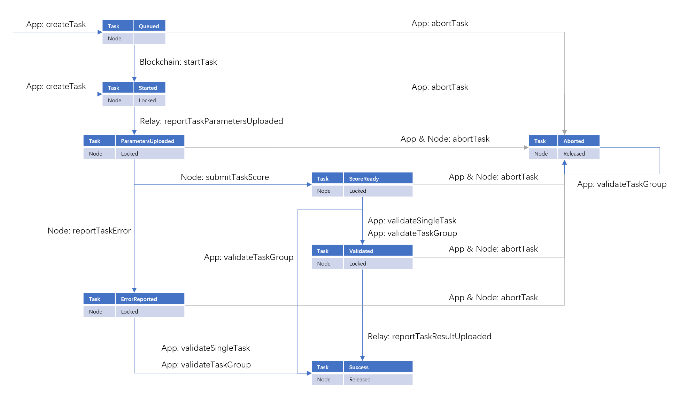

## The Smart Contracts for the Crynux Network

The solidity contracts to coordinate the nodes and tasks.

### Task State Transitions


### Compilation

The contracts are developed using the Truffle framework.

Install the dependencies before compilation:

```shell
$ npm install
```

Run truffle compiling command using npm:

```shell
$ npm run compile
```

### Tests

All the test files are located under [```./test```](./test). The tests could be executed using npm:

```shell
$ npm run test
```

### Generating Contract ABIs

The ABIs are generated using [truffle-plugin-abigen](https://github.com/ChainSafe/truffle-plugin-abigen).

Create a folder named ```abigenBindings``` under the project root folder and then run the following command:

```shell
$ npm run abi
```
