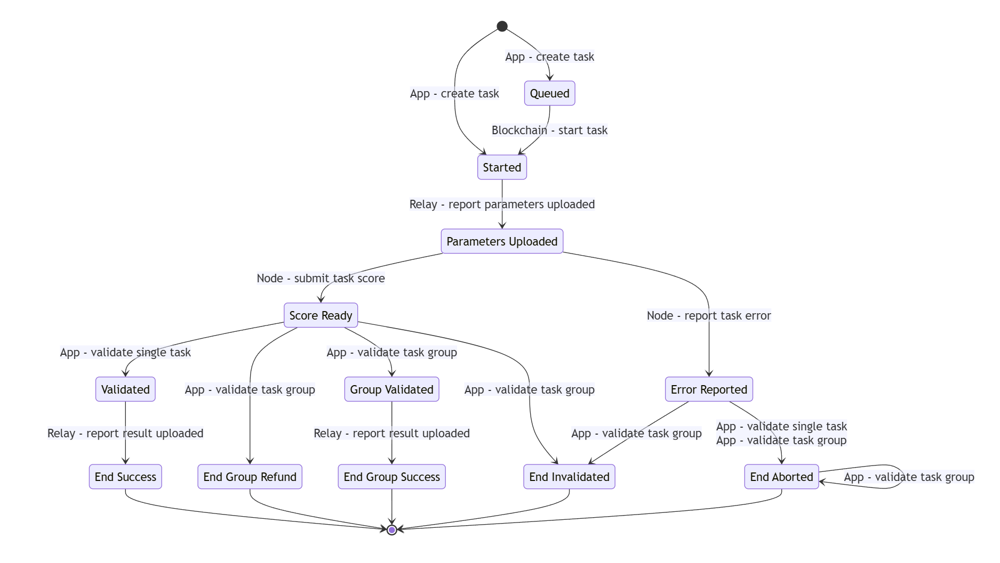

## The Smart Contracts for the Crynux Network

The solidity contracts to coordinate the nodes and tasks.

### Task State Transitions


### Compilation and Generating Contract ABIs

The contracts are developed using the Hardhat framework.

Install the dependencies before compilation:

```shell
$ npm install
```

Run hardhat compiling command using npm:

ABI is generated using [@symblox/hardhat-abi-gen](https://github.com/symblox/hardhat-abi-gen/).

```shell
$ mkdir abi && npm run compile
```

### Tests

All the test files are located under [```./test```](./test). The tests could be executed using npm:

```shell
$ npm run test
$ npx hardhat test
```

### Run coverage
```
$ npx hardhat coverage && open coverage/index.html
```
